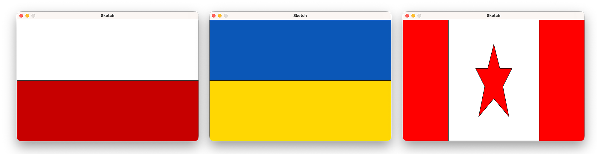

# Method Decomposition

When programs grow in size, writing everything in one giant block of code becomes messy, repetitive, and hard to follow. Good programmers break large tasks into smaller, focused methods — each doing one job. This is called **method decomposition**.

In this lesson, we'll start with a program that draws one of three country flags at random, and refactor it step by step into cleaner, more maintainable code.

---

## The Program

When run, the program randomly displays one of three flags:

- **Poland** — two horizontal bars, white over red
- **Ukraine** — two horizontal bars, blue over yellow
- **Canada** — vertical red bars with a maple leaf

Each time you run it, a different flag may appear.



---

## Setup

1. Clone this repository and open the **root folder** in VS Code/VSCodium (not the `src/` subfolder).
2. Press **`Cmd+Shift+B`** (Mac) or **`Ctrl+Shift+B`** (Windows) to compile and run `Sketch.java`.
3. To run the completed reference files, use **Terminal > Run Task** and select the step you want.

> [!TIP]
> Before running, read through `Sketch.java` and predict what you'll see. Then run it a few times to confirm all three flags are possible.

---

## The Repo

```
Method-Decomposition/
├── src/
│   ├── Sketch.java                  ← your live working file
│   ├── Step1_OneFlagPerMethod.java  ← completed Step 1 (reference)
│   ├── Step2_ReusableMethods.java   ← completed Step 2 (reference)
│   └── Step3_BetterMapleLeaf.java   ← completed Step 3 (reference)
├── bin/     ← compiled output (don't touch)
└── lib/     ← Processing library (don't touch)
```

Work in **`Sketch.java`**. The Step 1–3 files are completed reference versions you can run and compare against.

---

## Step 0 — The Spaghetti Code

Open `Sketch.java`. Here's what `setup()` looks like:

```java
public void setup() {
    background(255);

    int choice = (int) random(3);

    if (choice == 0) {
        // Polish flag (white over red)
        fill(255);
        rect(0, 0, width, height / 2);
        fill(200, 0, 0);
        rect(0, height / 2, width, height / 2);

    } else if (choice == 1) {
        // Ukraine flag (blue over yellow)
        fill(0, 87, 183);
        rect(0, 0, width, height / 2);
        fill(255, 215, 0);
        rect(0, height / 2, width, height / 2);

    } else {
        // Canada flag
        fill(255, 0, 0);
        rect(0, 0, width / 4, height);
        rect(3 * width / 4, 0, width / 4, height);
        fill(255);
        rect(width / 4, 0, width / 2, height);
        fill(255, 0, 0);
        beginShape();
        vertex(width / 2, 80);
        // ... more vertices ...
        endShape(CLOSE);
    }
}
```

The program works — but there are problems:

- All the drawing logic is crammed into `setup()`, which has grown long and hard to read.
- The Poland and Ukraine sections are nearly identical — repeated code.
- The Canadian flag mixes stripe-drawing and maple leaf-drawing in the same block.
- The leaf uses a pile of hardcoded numbers with no explanation — [magic numbers](https://davecheng-tech.github.io/Class-Notes-and-Addenda/ICS3U/style#magic-numbers-vs-meaning).

Code that works but is tangled, repetitive, and hard to follow is sometimes called **spaghetti code**.

> [!NOTE]
> What would you have to do to add a fourth flag? Or fix a bug in just the Canadian stripes? How long would it take you to find the right place to edit?

---

## Step 1 — One Method Per Flag

**Goal:** Move each flag's drawing code into its own method. Don't fix anything else yet — just reorganize.

After the refactor, `setup()` should look like this:

```java
public void setup() {
    background(255);

    int choice = (int) random(3);

    if (choice == 0) {
        drawPolandFlag();
    } else if (choice == 1) {
        drawUkraineFlag();
    } else {
        drawCanadaFlag();
    }
}
```

> [!TIP]
> In `Sketch.java`, create three new methods — `drawPolandFlag()`, `drawUkraineFlag()`, and `drawCanadaFlag()` — and move the drawing code into them. Run it to confirm it still works.

Then run the reference version to compare:

**Terminal > Run Task > "Step 1: One Method Per Flag"**

### What improved?

- `setup()` is now short and easy to read — at a glance, you can see the three possibilities.
- Each flag lives in its own named method. If you need to fix the Ukrainian flag, you go straight to `drawUkraineFlag()`.
- Adding a fourth flag is now just adding one method and one line in `setup()`.

### What's still not great?

- `drawPolandFlag()` and `drawUkraineFlag()` are nearly identical — both draw two horizontal rectangles. Repeated code.
- `drawCanadaFlag()` still mixes stripe-drawing and maple leaf-drawing in one method.
- The leaf shape is still a wall of unexplained numbers.

> [!NOTE]
> Look at `drawPolandFlag()` and `drawUkraineFlag()`. What's actually different between them? What if you needed to add a German flag, or a French flag — would you write another near-copy of the same code?

---

## Step 2 — Reusable Methods and Clean Structure

**Goal:** Eliminate the repeated code by creating a general-purpose method. Break the Canadian flag into two focused helpers.

### The horizontal flag pattern

Poland and Ukraine both draw two horizontal rectangles with different colours. Instead of two nearly-identical methods, write one method that accepts the colours as parameters:

```java
private void drawBicolorHorizontalFlag(int topR, int topG, int topB,
                                       int bottomR, int bottomG, int bottomB) {
    fill(topR, topG, topB);
    rect(0, 0, width, height / 2);

    fill(bottomR, bottomG, bottomB);
    rect(0, height / 2, width, height / 2);
}
```

Now `setup()` can call it with any two colours:

```java
drawBicolorHorizontalFlag(255, 255, 255, 200, 0, 0);  // Poland: white over red
drawBicolorHorizontalFlag(0, 87, 183, 255, 215, 0);   // Ukraine: blue over yellow
```

### Breaking up the Canadian flag

Split `drawCanadaFlag()` into two helpers:

```java
private void drawCanadaFlag() {
    drawCanadaStripes();
    drawMapleLeaf();
}

private void drawCanadaStripes() {
    fill(255, 0, 0);
    rect(0, 0, width / 4, height);
    rect(3 * width / 4, 0, width / 4, height);
    fill(255);
    rect(width / 4, 0, width / 2, height);
}

private void drawMapleLeaf() {
    // simplified star shape for now
    fill(255, 0, 0);
    beginShape();
    // ...
    endShape(CLOSE);
}
```

> [!TIP]
> Update `Sketch.java` with these changes. Run it — the output should look identical to before.

Then run the reference version to compare:

**Terminal > Run Task > "Step 2: Reusable Methods"**

### What improved?

- No more repeated code — `drawBicolorHorizontalFlag()` handles any two-colour horizontal flag.
- `drawCanadaFlag()` is now just two lines: delegate to stripes, delegate to leaf. Clean and readable.
- `drawMapleLeaf()` is completely isolated. You can update or replace it without touching anything else.

> [!NOTE]
> Notice the **call tree**: `setup()` calls `drawCanadaFlag()`, which calls `drawCanadaStripes()` and `drawMapleLeaf()`. Larger tasks delegate to smaller helpers. This is called **method composition**.

> [!IMPORTANT]
> The key principle: **each method should do one thing, and do it well.** When you read a method name, you should know exactly what it does — and nothing else should be in there.

---

## Step 3 — Drop In a Better Maple Leaf

Here's the payoff.

The simplified "maple leaf" in `drawMapleLeaf()` is really just a star shape — not very convincing. But because `drawMapleLeaf()` is completely isolated from the rest of the code, we can replace it with a much more accurate version without touching *anything else*.

> [!NOTE]
> Think about it: if the leaf code were still tangled inside `drawCanadaFlag()` or `setup()`, what would you have to be careful about when replacing it? How does isolating it make this upgrade easier?

### Replace `drawMapleLeaf()` with this version

In `Sketch.java`, delete the old `drawMapleLeaf()` method and replace it with this one:

```java
/**
 * Draws an accurate maple leaf centred at (cx, cy) with a scale factor.
 * Vertices traced from a reference image of the Canadian flag.
 *
 * @param cx  centre x-position
 * @param cy  centre y-position
 * @param s   scale factor (1.0 = original traced size)
 */
private void drawMapleLeaf(float cx, float cy, float s) {
    final float CEN_X = 300;
    final float CEN_Y = 330;

    fill(255, 0, 0);
    beginShape();
    vertex(cx + (302 - CEN_X) * s, cy + (6   - CEN_Y) * s);
    vertex(cx + (362 - CEN_X) * s, cy + (111 - CEN_Y) * s);
    vertex(cx + (420 - CEN_X) * s, cy + (87  - CEN_Y) * s);
    vertex(cx + (387 - CEN_X) * s, cy + (267 - CEN_Y) * s);
    vertex(cx + (474 - CEN_X) * s, cy + (180 - CEN_Y) * s);
    vertex(cx + (488 - CEN_X) * s, cy + (227 - CEN_Y) * s);
    vertex(cx + (580 - CEN_X) * s, cy + (207 - CEN_Y) * s);
    vertex(cx + (552 - CEN_X) * s, cy + (311 - CEN_Y) * s);
    vertex(cx + (590 - CEN_X) * s, cy + (332 - CEN_Y) * s);
    vertex(cx + (444 - CEN_X) * s, cy + (457 - CEN_Y) * s);
    vertex(cx + (461 - CEN_X) * s, cy + (511 - CEN_Y) * s);
    vertex(cx + (312 - CEN_X) * s, cy + (496 - CEN_Y) * s);
    vertex(cx + (312 - CEN_X) * s, cy + (656 - CEN_Y) * s);
    vertex(cx + (290 - CEN_X) * s, cy + (657 - CEN_Y) * s);
    vertex(cx + (294 - CEN_X) * s, cy + (495 - CEN_Y) * s);
    vertex(cx + (148 - CEN_X) * s, cy + (513 - CEN_Y) * s);
    vertex(cx + (162 - CEN_X) * s, cy + (462 - CEN_Y) * s);
    vertex(cx + (15  - CEN_X) * s, cy + (331 - CEN_Y) * s);
    vertex(cx + (54  - CEN_X) * s, cy + (315 - CEN_Y) * s);
    vertex(cx + (27  - CEN_X) * s, cy + (206 - CEN_Y) * s);
    vertex(cx + (116 - CEN_X) * s, cy + (226 - CEN_Y) * s);
    vertex(cx + (132 - CEN_X) * s, cy + (177 - CEN_Y) * s);
    vertex(cx + (216 - CEN_X) * s, cy + (265 - CEN_Y) * s);
    vertex(cx + (191 - CEN_X) * s, cy + (87  - CEN_Y) * s);
    vertex(cx + (246 - CEN_X) * s, cy + (114 - CEN_Y) * s);
    endShape(CLOSE);
}
```

The new signature has parameters, so you also need to update the call in `drawCanadaFlag()`:

```java
private void drawCanadaFlag() {
    drawCanadaStripes();
    drawMapleLeaf(width / 2, height / 2, 0.35f);
}
```

> [!TIP]
> Make these two changes in `Sketch.java` and run it. Keep re-running until you see the Canadian flag — the difference should be obvious.

Then run the reference version to compare:

**Terminal > Run Task > "Step 3: Better Maple Leaf"**

---

## Summary

Here's the progression we walked through:

| | `setup()` | Repeated code | Leaf isolated? |
|---|---|---|---|
| Spaghetti | Everything crammed in | Yes | No |
| Step 1 | 3 clean method calls | Yes | No |
| Step 2 | 3 clean method calls | No | Yes |
| Step 3 | 3 clean method calls | No | Yes, upgraded |

The core ideas behind method decomposition:

- **One job per method.** A method that does two things should probably be two methods.
- **Small methods are easier to read, test, and fix.** You can understand them in isolation.
- **Reusable methods reduce repetition.** Write it once, call it many times.
- **Good structure makes changes safe.** When methods have limited scope, upgrading one thing doesn't risk breaking everything else.
