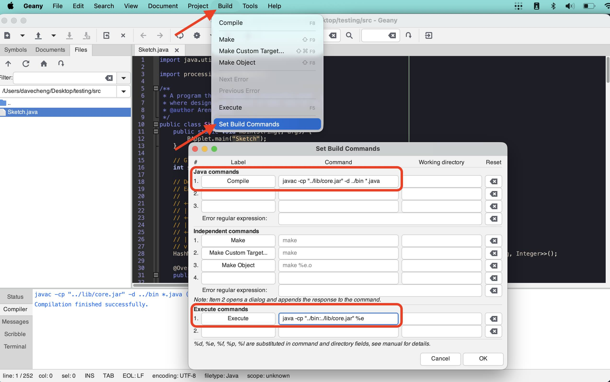

# ICS3U Processing Template

Starter template for Java Processing assignments.

## Folder Structure

```
processing-template/
|-- .vscode/        - editor settings for VSCodium/VS Code
|-- bin/            - compiled .class files go here (don't touch)
|-- lib/            - contains core.jar (the Processing library)
+-- src/
    +-- Sketch.java - your code goes here
```

- **`src/Sketch.java`** is your starting point. Write your code here.
- **`bin/`** is where Java puts the compiled output. You don't need to edit anything here.
- **`lib/core.jar`** is the Processing library. Don't delete it. Your program won't run without it.

## Setup - VSCodium

### Step 1 - Open the Project Folder

In VSCodium, go to **File > Open Folder** and select the **root project folder** (e.g. `processing-template/`).

> [!IMPORTANT]
> Open the root folder, not the `src/` subfolder. The build task won't work otherwise.

### Step 2 - Compile and Run

Press **`Ctrl+Shift+B`** (Windows / Linux) or **`Cmd+Shift+B`** (macOS) to compile and run your sketch. You can also use **Terminal > Run Build Task** from the menu.

Errors will appear in the Terminal panel at the bottom of the screen.

## Setup - Geany

### Step 1 - Open Your File

1. Open Geany.
2. Navigate to the `src/` folder inside your project.
3. Open **`Sketch.java`**.

> [!IMPORTANT]
> Make sure `Sketch.java` is the active tab before compiling or running.

### Step 2 - Configure Build Commands

Go to **Build > Set Build Commands** and fill in the fields as shown below.



#### Compile (all platforms)
```
javac -cp "../lib/core.jar" -d ../bin *.java
```

#### Execute - macOS / Linux
```
java -cp "../bin:../lib/core.jar" Sketch
```

#### Execute - Windows
```
java -cp "../bin;../lib/core.jar" Sketch
```

> [!NOTE]
> The only difference between macOS/Linux and Windows is the separator between paths: `:` on macOS/Linux, `;` on Windows.

Leave all other fields blank. Click **OK**.

### Step 3 - Compile and Run

- Press **F8** (or **Build > Compile**) to compile.
- Press **F5** (or **Build > Execute**) to run.

If there are errors, check the output at the bottom of the Geany window.

## Sketch.java - What's Inside

```java
import processing.core.PApplet;

/**
 * Template for programs with Processing graphics output.
 * @author Your Name
 */
public class Sketch extends PApplet {
    public static void main(String[] args) {
        PApplet.main("Sketch");
    }

    /** Set up canvas size. */
    public void settings() {
        size(600, 600);
    }

    /** Runs once at start - use for static drawings or initial setup. */
    public void setup() {
        background(120, 197, 227);
        fill(242, 19, 224);
        noStroke();
        circle(300, 300, 200);
    }

    /** Loops continuously - use for animation and dynamic drawings. */
    public void draw() {

    }
}
```

- `settings()` - set your canvas size
- `setup()` - runs once when the program starts
- `draw()` - runs on a loop, many times per second
